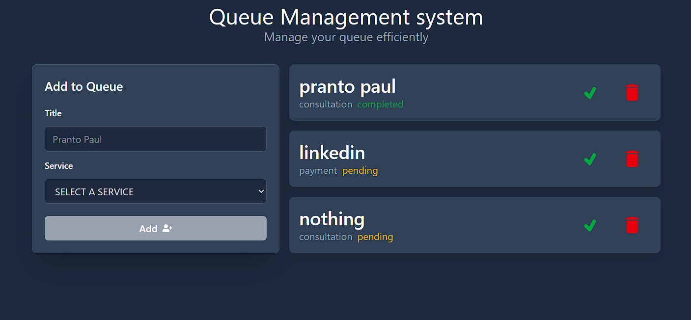

# Queue Management System

A lightweight Queue Management System built with React and Tailwind CSS. This project demonstrates clean component architecture, controlled forms, and state-driven UI updates. It allows users to add customers to a queue, update their status, and remove them efficiently.


## Preview



## Overview

The application is designed as a simple in-memory queue tracker. It focuses on:

- Clear component separation
- Unidirectional data flow
- Practical use of React hooks
- Responsive UI with Tailwind CSS
- Clean and minimal user experience

This project is suitable for learning React fundamentals and can be extended into a production-ready system with backend integration and persistent storage.

---

## Features

- Add customers to a queue with name and service type
- Automatically assign unique ID to each queue item
- Default status set to `pending`
- Mark customers as `completed`
- Remove customers from the queue
- Empty state handling
- Responsive layout
- Modern UI using Tailwind CSS
- Icons integrated with react-icons


## Tech Stack

- React
- Tailwind CSS
- React Icons
- JavaScript (ES6+)


## Project Structure
```
src/
│
├── components/
│ ├── Form.jsx
│ └── Display.jsx
│
├── App.jsx
└── main.jsx / index.jsx
```


## How It Works

### 1. State Management

The main queue state is stored inside `App.jsx` using React's `useState`.

Each queue item has the following structure:

```json
{
  "id": Date.now(),
  "title": "Customer Name",
  "service": "payment",
  "status": "pending"
}
```
State is updated immutably using array mapping and filtering.

## 2.Core Functions
#### Add to Queue

- Adds a new customer with a unique ID and default pending status.

#### Update Status

- Updates a specific customer's status using their ID.

#### Remove from Queue

- Removes a customer from the queue by filtering their ID out of the array.

### Installation
clone the repository:
```bash
git clone https://github.com/Pranto-Paul/queue-management.git
cd queue-management
```
install dependencies:
```bash
bun install
```
---
### Running the project
```bash
bun run dev
```
## UI Architechture
#### App.jsx
- Manages global queue states with handler functions related to **CRUD** functionality of the queue
- Passes handlers as props to childs

#### Form.jsx
- Controlled from inputs
- Validates before submission
- Calls **addToQueue**

#### Display.jsx
- Renders queue list dynamically
- Handles status updates and deletion

## License
This project is open-source and available under the MIT License.
